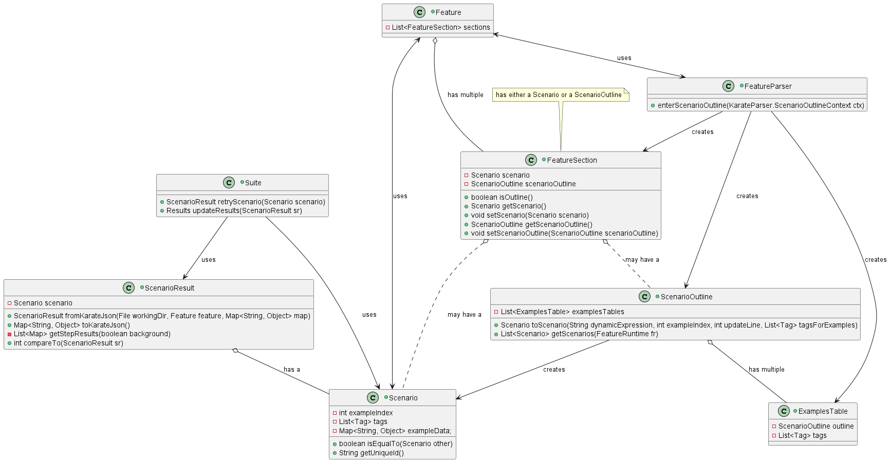

# Report for assignment 4

## Project

Name: karate

URL: https://github.com/karatelabs/karate

Karate is a framework used for test automation. It combines API testing, mocking, performance testing and UI testing in one tool.

## Onboarding experience

Did you choose a new project or continue on the previous one?

If you changed the project, how did your experience differ from before?

## Effort spent

For each team member, how much time was spent in

1. plenary discussions/meetings;

2. discussions within parts of the group;

3. reading documentation;

4. configuration and setup;

5. analyzing code/output;

6. writing documentation;

7. writing code;

8. running code?

For setting up tools and libraries (step 4), enumerate all dependencies
you took care of and where you spent your time, if that time exceeds
30 minutes.

## Overview of issue(s) and work done.

Title:

URL:

Summary in one or two sentences

Scope (functionality and code affected).

## Requirements for the new feature or requirements affected by functionality being refactored

Optional (point 3): trace tests to requirements.

## Code changes

### Patch

(copy your changes or the add git command to show them)

git diff ...

Optional (point 4): the patch is clean.

Optional (point 5): considered for acceptance (passes all automated checks).

## Test results

Overall results with link to a copy or excerpt of the logs (before/after
refactoring).

## UML class diagram and its description

The UML diagram shows the structure of the classes that were involved in fixing the issue. For context, some classes
not affected or affected very little are also shown, to illustrate how the core classes involved are created and interact. 

The most important part is that ScenarioOutline contains one or more `ExamplesTable`, which it uses to generate Scenarios. `Scenario` was the class most affected by the changes, as we needed to add a new field, `exampleTableIndex`, renaming the original `exampleIndex` to `exampleRowIndex`. This change required adjustments to many other methods, such as initially setting it in `ScenarioOutline`, or adjusting `ScenarioResult` methods for comparing and creating from JSON. The Suite class is included as its `retryScenario` and `updateResults` methods were the cause of the issue, but it did not have to be changed, as we fixed the methods it relied on. After we fixed the first requirement, the tags issue only required changes in `ScenarioResult:fromKarateJson`. 

The diagram shows the structure before the changes, but the only differences that would be noticeable afterwards is that
`getExampleTableIndex` and `setExampleTableIndex` would be present in the `Scenario` class. Most changes are internally in the methods and would not affect the structure of the diagram, but some methods like `toScenario` would have `exampleTableIndex` as a new parameter. 

## Overall experience

What are your main take-aways from this project? What did you learn?

How did you grow as a team, using the Essence standard to evaluate yourself?

Optional (point 6): How would you put your work in context with best software engineering practice?

Optional (point 7): Is there something special you want to mention here?
